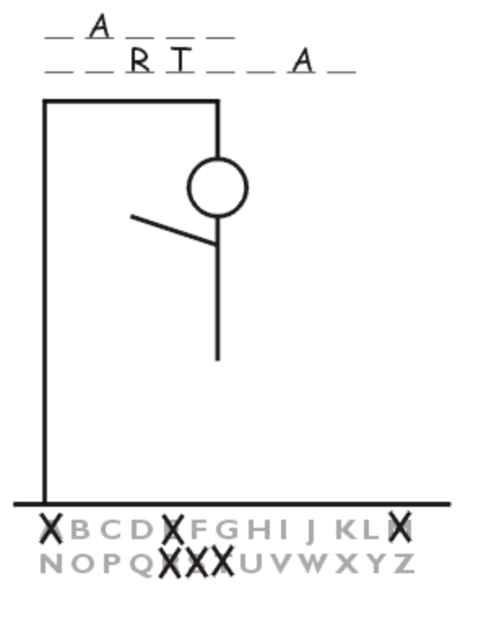

## Programming Challenge

Programming Hangman.

This will be a continuation of the challenge from day three. Now that you have been able to randomly choose a word from the document vocab_words.txt and parse through the word, you will now start asking for user input. Ask the user for a letter and if it matches one of the letters in the word, print out the letter at its position, if not, print out that they have guessed wrongly, and show them how many guesses they have remaining.

Example run ...

Let's Play Hangman! It is a 3 letter word
_ _ _  
What is your first guess:  a
That is incorrect, you now have 5 more chances. What is your next guess: h
There is 1 'h'
_ h _
Next guess: e
Correct.
_ h e
There is one 'e'. Next guess: g
Incorrect, you now have 4 guesses remaining. Next guess: t
Hooray! You won! You have correctly spelled out the word 'the'.
t h e



Hangman Rules:  
1. The guesser has 11 chances. A chance is deducted everytime they guess wrongly. 
2. If the user guesses correctly, no deductions should occur.
Below is a picture of a sample run.

 

<i>Photo curtesy of printactivities.com [Link](http://www.printactivities.com/Paper-Games/Rules-For-Hangman.shtml)</i>

<b>[BONUS]: </b> Print out each part of the hangman upon each guess, only adding to it if the user guesses wrong.
